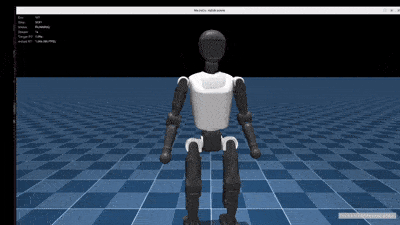
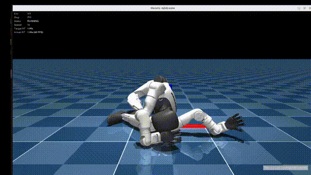
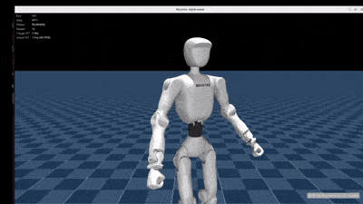
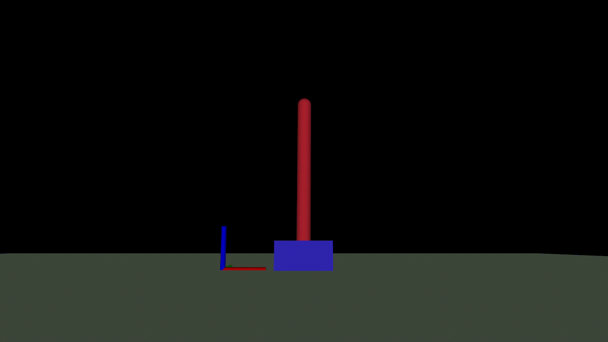
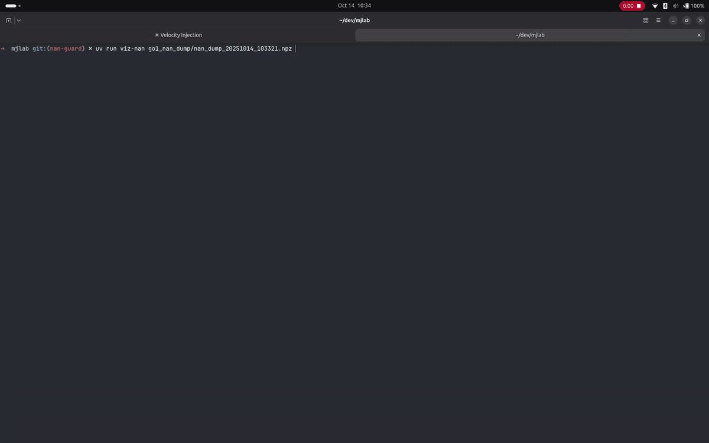

# mjlab Biped Playground

This repo is a fork of [asimovinc/asimov-mjlab](https://github.com/asimovinc/asimov-mjlab), narrowed down to a playground for **bipedal humanoid robots** built on [mjlab](https://github.com/mujocolab/mjlab). It currently targets four platforms: **Booster T1**, **Unitree G1**, **Booster T2**, and **Asimov**.

---

## Robots

| Robot | Asset | Trainable tasks |
|-------|-------|------------------|
| **Booster T1** | ✅ `asset_zoo/robots/booster_t1` | `Mjlab-Getup-Flat-Booster-T1`, `Mjlab-Velocity-Flat-Booster-T1`, `Mjlab-Velocity-Rough-Booster-T1` |
| **Unitree G1** | ✅ `asset_zoo/robots/unitree_g1` | `Mjlab-Getup-Flat-Unitree-G1` |
| **Booster T2** | ✅ `asset_zoo/robots/booster_t2` | `Mjlab-Getup-Flat-Booster-T2` |
| **Asimov** | ✅ `asset_zoo/robots/asimov` | `Mjlab-Velocity-Flat-Asimov`, `Mjlab-Velocity-Rough-Asimov` |

Velocity-tracking tasks (flat/rough terrain locomotion) have been ported back for Booster T1 and Asimov. Unitree G1 and Booster T2 don't have a registered velocity task yet — contributions welcome.

---

## Tasks

### Getup (fall recovery)

Teaches the robot to stand back up from a fallen pose on flat terrain.

| Task ID | Robot |
|---------|-------|
| `Mjlab-Getup-Flat-Booster-T1` | Booster T1 |
| `Mjlab-Getup-Flat-Unitree-G1` | Unitree G1 |
| `Mjlab-Getup-Flat-Booster-T2` | Booster T2 |

Configs live under `src/playground/tasks/getup/config/<robot>/`.

### Velocity (locomotion)

Teaches the robot to track commanded linear/angular velocities while walking, on flat or rough terrain.

| Task ID | Robot |
|---------|-------|
| `Mjlab-Velocity-Flat-Booster-T1` | Booster T1 |
| `Mjlab-Velocity-Rough-Booster-T1` | Booster T1 |
| `Mjlab-Velocity-Flat-Asimov` | Asimov |
| `Mjlab-Velocity-Rough-Asimov` | Asimov |

Configs live under `src/playground/tasks/velocity/config/<robot>/`.

### Demos

<!-- Placeholder GIFs — replace with actual play-mode recordings per task. -->

| GIF | Description | Play Command |
|-----|-------|--------------|
| <br/>**Mjlab-Getup-Flat-Booster-T1** | Booster T1 recovers from a fallen pose and stands back up on flat terrain. | `uv run play Mjlab-Getup-Flat-Booster-T1 --wandb-run-path /path/to/my/wandb` |
| <br/>**Mjlab-Getup-Flat-Unitree-G1** | Unitree G1 recovers from a fallen pose and stands back up on flat terrain. | `uv run play Mjlab-Getup-Flat-Unitree-G1 --wandb-run-path /path/to/my/wandb` |
| <br/>**Mjlab-Getup-Flat-Booster-T2** | Booster T2 recovers from a fallen pose and stands back up on flat terrain. | `uv run play Mjlab-Getup-Flat-Booster-T2 --wandb-run-path /path/to/my/wandb` |
| <br/>**Mjlab-Velocity-Flat-Booster-T1** | Booster T1 tracks commanded velocity on flat terrain. | `uv run play Mjlab-Velocity-Flat-Booster-T1 --wandb-run-path /path/to/my/wandb` |
| <br/>**Mjlab-Velocity-Rough-Booster-T1** | Booster T1 tracks commanded velocity on rough terrain. | `uv run play Mjlab-Velocity-Rough-Booster-T1 --wandb-run-path /path/to/my/wandb` |
| <br/>**Mjlab-Velocity-Flat-Asimov** | Asimov tracks commanded velocity on flat terrain. | `uv run play Mjlab-Velocity-Flat-Asimov --wandb-run-path /path/to/my/wandb` |
| <br/>**Mjlab-Velocity-Rough-Asimov** | Asimov tracks commanded velocity on rough terrain. | `uv run play Mjlab-Velocity-Rough-Asimov --wandb-run-path /path/to/my/wandb` |

---

## Quick Start
> [!NOTE]
> The following setup has only been tested on NVIDIA 4060 and NVIDIA 5080 GPUs. We don't know (yet) if this setup works on CPU only.

```bash
# Install uv if you haven't already
curl -LsSf https://astral.sh/uv/install.sh | sh

# Clone and run
git clone https://github.com/LIRA-UNAM/mjlab-biped-playground.git
cd mjlab-biped-playground
uv sync
# If you get dependency errors, try using a more up-to-date version of the package that is failing
```

### Train

> [!IMPORTANT]
> You first need to create a WANDB account. Once you log in, the script will ask you for the API key to connect training with your account.

```bash
uv run train Mjlab-Getup-Flat-Booster-T1 --env.scene.num-envs 4096
# or
uv run train Mjlab-Getup-Flat-Unitree-G1 --env.scene.num-envs 4096
# or
uv run train Mjlab-Getup-Flat-Booster-T2 --env.scene.num-envs 4096
# or
uv run train Mjlab-Velocity-Flat-Booster-T1 --env.scene.num-envs 4096
# or
uv run train Mjlab-Velocity-Rough-Booster-T1 --env.scene.num-envs 4096
# or
uv run train Mjlab-Velocity-Flat-Asimov --env.scene.num-envs 4096
# or
uv run train Mjlab-Velocity-Rough-Asimov --env.scene.num-envs 4096
```

### Evaluate Policy

```bash
uv run play Mjlab-Getup-Flat-Booster-T1 --wandb-run-path /path/to/my/wandb
# or
uv run play Mjlab-Getup-Flat-Unitree-G1 --wandb-run-path /path/to/my/wandb
# or
uv run play Mjlab-Getup-Flat-Booster-T2 --wandb-run-path /path/to/my/wandb
# or
uv run play Mjlab-Velocity-Flat-Booster-T1 --wandb-run-path /path/to/my/wandb
# or
uv run play Mjlab-Velocity-Rough-Booster-T1 --wandb-run-path /path/to/my/wandb
# or
uv run play Mjlab-Velocity-Flat-Asimov --wandb-run-path /path/to/my/wandb
# or
uv run play Mjlab-Velocity-Rough-Asimov --wandb-run-path /path/to/my/wandb
```

---

## License
Based on [mjlab](https://github.com/mujocolab/mjlab) by MuJoCo Lab.
