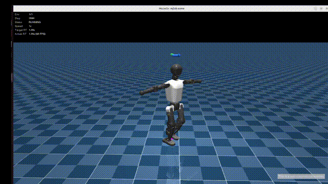
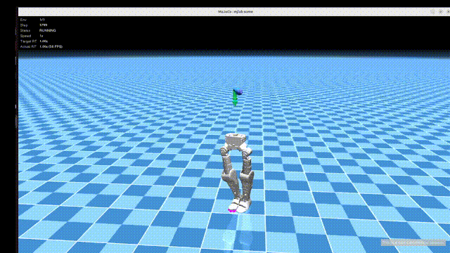

# mjlab Biped Playground

This repo is a fork of [asimovinc/asimov-mjlab](https://github.com/asimovinc/asimov-mjlab), narrowed down to a playground for **bipedal humanoid robots** built on [mjlab](https://github.com/mujocolab/mjlab). It currently targets five platforms: **Booster T1**, **Booster K1**, **Unitree G1**, **Booster T2**, and **Asimov**.

---

## Robots

| Robot | Asset | Trainable tasks |
|-------|-------|------------------|
| **Booster T1** | ✅ `asset_zoo/robots/booster_t1` | `Mjlab-Getup-Flat-Booster-T1`, `Mjlab-Velocity-Flat-Booster-T1-PPO`, `Mjlab-Velocity-Rough-Booster-T1-PPO`, `Mjlab-Velocity-Flat-Booster-T1-FlashSAC`, `Mjlab-Velocity-Rough-Booster-T1-FlashSAC` |
| **Booster K1** | ✅ `asset_zoo/robots/k1` | `Mjlab-Getup-Flat-Booster-K1`, `Mjlab-Velocity-Flat-Booster-K1-PPO`, `Mjlab-Velocity-Rough-Booster-K1-PPO`, `Mjlab-Velocity-Flat-Booster-K1-FlashSAC`, `Mjlab-Velocity-Rough-Booster-K1-FlashSAC` |
| **Unitree G1** | ✅ `asset_zoo/robots/unitree_g1` | `Mjlab-Getup-Flat-Unitree-G1` |
| **Booster T2** | ✅ `asset_zoo/robots/booster_t2` | `Mjlab-Getup-Flat-Booster-T2` |
| **Asimov** | ✅ `asset_zoo/robots/asimov` | `Mjlab-Velocity-Flat-Asimov`, `Mjlab-Velocity-Rough-Asimov` |

Velocity-tracking tasks (flat/rough terrain locomotion) have been ported back for Booster T1, Booster K1, and Asimov. Booster T1 and Booster K1 each offer both an on-policy (PPO) and an off-policy (FlashSAC) variant. Unitree G1 and Booster T2 don't have a registered velocity task yet — contributions welcome.

---

## Tasks

### Getup (fall recovery)

Teaches the robot to stand back up from a fallen pose on flat terrain.

| Task ID | Robot |
|---------|-------|
| `Mjlab-Getup-Flat-Booster-T1` | Booster T1 |
| `Mjlab-Getup-Flat-Booster-K1` | Booster K1 |
| `Mjlab-Getup-Flat-Unitree-G1` | Unitree G1 |
| `Mjlab-Getup-Flat-Booster-T2` | Booster T2 |

Configs live under `src/playground/tasks/getup/config/<robot>/`.

### Velocity (locomotion)

Teaches the robot to track commanded linear/angular velocities while walking, on flat or rough terrain. Booster T1 and Booster K1 each have both an on-policy PPO variant and an off-policy FlashSAC variant.

| Task ID | Robot | Algorithm |
|---------|-------|-----------|
| `Mjlab-Velocity-Flat-Booster-T1-PPO` | Booster T1 | PPO |
| `Mjlab-Velocity-Rough-Booster-T1-PPO` | Booster T1 | PPO |
| `Mjlab-Velocity-Flat-Booster-T1-FlashSAC` | Booster T1 | FlashSAC |
| `Mjlab-Velocity-Rough-Booster-T1-FlashSAC` | Booster T1 | FlashSAC |
| `Mjlab-Velocity-Flat-Booster-K1-PPO` | Booster K1 | PPO |
| `Mjlab-Velocity-Rough-Booster-K1-PPO` | Booster K1 | PPO |
| `Mjlab-Velocity-Flat-Booster-K1-FlashSAC` | Booster K1 | FlashSAC |
| `Mjlab-Velocity-Rough-Booster-K1-FlashSAC` | Booster K1 | FlashSAC |
| `Mjlab-Velocity-Flat-Asimov` | Asimov | PPO |
| `Mjlab-Velocity-Rough-Asimov` | Asimov | PPO |

Configs live under `src/playground/tasks/velocity/config/<robot>/`.

> [!NOTE]
> FlashSAC is off-policy, so it needs far fewer parallel environments than PPO. Train FlashSAC tasks with `--env.scene.num_envs 1024` instead of the larger PPO env counts.

#### Opt-in Booster K1 variants

Each K1 velocity task also has opt-in variants, registered for both `Flat` and `Rough` terrain (e.g. `Mjlab-Velocity-Flat-Booster-K1-PPO-DA`):

| Suffix | Algorithm | What it adds |
|---|---|---|
| `-PPO-DA` | PPO | Left/right mirror data augmentation on every mini-batch |
| `-FlashSAC-DA` | FlashSAC | Left/right mirror data augmentation on every replay mini-batch |

The mirror lives in `config/k1/symmetry.py`. It derives its layout from the live observation manager and raises on any observation term it has no rule for, so a new term has to be given a mirror rule before it can be used with `-DA`.

### Getup Tasks

<!-- Placeholder GIFs — replace with actual play-mode recordings per task. -->

| GIF | Description | Play Command |
|-----|-------|--------------|
| <br/>**Mjlab-Getup-Flat-Booster-T1** | Booster T1 recovers from a fallen pose and stands back up on flat terrain. | `uv run play Mjlab-Getup-Flat-Booster-T1 --wandb-run-path /path/to/my/wandb` |
| <br/>**Mjlab-Getup-Flat-Unitree-G1** | Unitree G1 recovers from a fallen pose and stands back up on flat terrain. | `uv run play Mjlab-Getup-Flat-Unitree-G1 --wandb-run-path /path/to/my/wandb` |
| <br/>**Mjlab-Getup-Flat-Booster-T2** | Booster T2 recovers from a fallen pose and stands back up on flat terrain. | `uv run play Mjlab-Getup-Flat-Booster-T2 --wandb-run-path /path/to/my/wandb` |

### Velocity Tasks
| GIF | Description | Play Command |
|-----|-------|--------------|
| <br/>**Mjlab-Velocity-Flat-Booster-T1-PPO** | Booster T1 tracks commanded velocity on flat terrain (PPO). | `uv run play Mjlab-Velocity-Flat-Booster-T1-PPO --wandb-run-path /path/to/my/wandb` |
| <br/>**Mjlab-Velocity-Flat-Asimov** | Asimov tracks commanded velocity on flat terrain. | `uv run play Mjlab-Velocity-Flat-Asimov --wandb-run-path /path/to/my/wandb` |

---

## Quick Start
> [!NOTE]
> The following setup has only been tested on NVIDIA 4060 and NVIDIA 5080 GPUs. We don't know (yet) if this setup works on CPU only.

```bash
# Install uv if you haven't already
curl -LsSf https://astral.sh/uv/install.sh | sh

# Clone and run
git clone https://github.com/LIRA-UNAM/mjlab-biped-playground.git
cd mjlab-biped-playground
uv sync
# If you get dependency errors, try using a more up-to-date version of the package that is failing
```

### Train

> [!IMPORTANT]
> You first need to create a WANDB account. Once you log in, the script will ask you for the API key to connect training with your account.

```bash
uv run train Mjlab-Getup-Flat-Booster-T1 --env.scene.num-envs 4096
# or
uv run train Mjlab-Getup-Flat-Booster-K1 --env.scene.num-envs 4096
# or
uv run train Mjlab-Getup-Flat-Unitree-G1 --env.scene.num-envs 4096
# or
uv run train Mjlab-Getup-Flat-Booster-T2 --env.scene.num-envs 4096
# or
uv run train Mjlab-Velocity-Flat-Booster-T1-PPO --env.scene.num-envs 4096
# or
uv run train Mjlab-Velocity-Rough-Booster-T1-PPO --env.scene.num-envs 4096
# or
uv run train Mjlab-Velocity-Flat-Booster-T1-FlashSAC --env.scene.num_envs 1024
# or
uv run train Mjlab-Velocity-Rough-Booster-T1-FlashSAC --env.scene.num_envs 1024
# or
uv run train Mjlab-Velocity-Flat-Booster-K1-PPO --env.scene.num-envs 4096
# or
uv run train Mjlab-Velocity-Rough-Booster-K1-PPO --env.scene.num-envs 4096
# or
uv run train Mjlab-Velocity-Flat-Booster-K1-FlashSAC --env.scene.num_envs 1024
# or
uv run train Mjlab-Velocity-Rough-Booster-K1-FlashSAC --env.scene.num_envs 1024
# or
uv run train Mjlab-Velocity-Flat-Asimov --env.scene.num-envs 4096
# or
uv run train Mjlab-Velocity-Rough-Asimov --env.scene.num-envs 4096
```

### Evaluate Policy

```bash
uv run play Mjlab-Getup-Flat-Booster-T1 --wandb-run-path /path/to/my/wandb
# or
uv run play Mjlab-Getup-Flat-Booster-K1 --wandb-run-path /path/to/my/wandb
# or
uv run play Mjlab-Getup-Flat-Unitree-G1 --wandb-run-path /path/to/my/wandb
# or
uv run play Mjlab-Getup-Flat-Booster-T2 --wandb-run-path /path/to/my/wandb
# or
uv run play Mjlab-Velocity-Flat-Booster-T1-PPO --wandb-run-path /path/to/my/wandb
# or
uv run play Mjlab-Velocity-Rough-Booster-T1-PPO --wandb-run-path /path/to/my/wandb
# or
uv run play Mjlab-Velocity-Flat-Booster-T1-FlashSAC --wandb-run-path /path/to/my/wandb
# or
uv run play Mjlab-Velocity-Rough-Booster-T1-FlashSAC --wandb-run-path /path/to/my/wandb
# or
uv run play Mjlab-Velocity-Flat-Booster-K1-PPO --wandb-run-path /path/to/my/wandb
# or
uv run play Mjlab-Velocity-Rough-Booster-K1-PPO --wandb-run-path /path/to/my/wandb
# or
uv run play Mjlab-Velocity-Flat-Booster-K1-FlashSAC --wandb-run-path /path/to/my/wandb
# or
uv run play Mjlab-Velocity-Rough-Booster-K1-FlashSAC --wandb-run-path /path/to/my/wandb
# or
uv run play Mjlab-Velocity-Flat-Asimov --wandb-run-path /path/to/my/wandb
# or
uv run play Mjlab-Velocity-Rough-Asimov --wandb-run-path /path/to/my/wandb
```

### Export Policy to ONNX

`export_policy.py` (repo root) exports a trained checkpoint for **any registered task** — PPO or FlashSAC — to a standalone ONNX file, so the policy can run outside mjlab/PyTorch (e.g. on real hardware, in a different simulator, or from a lightweight `onnxruntime`-only deployment). It follows the same two-stage CLI as `train`/`play`: task ID first, then options.

You must provide **exactly one** checkpoint source: `--checkpoint-file` (a local `.pt` path) or `--wandb-run-path` (downloads/caches the checkpoint from W&B, optionally pinned to a specific checkpoint with `--wandb-checkpoint-name`).

```bash
# From a local checkpoint file
uv run python export_policy.py Mjlab-Velocity-Flat-Booster-T1-PPO \
  --checkpoint-file logs/rsl_rl/t1_velocity/wandb_checkpoints/<run_id>/model_2999.pt

# From a W&B run (downloads the latest checkpoint by default)
uv run python export_policy.py Mjlab-Velocity-Flat-Booster-T1-FlashSAC \
  --wandb-run-path <entity>/<project>/<run_id>
# or pin a specific checkpoint:
uv run python export_policy.py Mjlab-Velocity-Flat-Booster-T1-FlashSAC \
  --wandb-run-path <entity>/<project>/<run_id> --wandb-checkpoint-name model_40000.pt

# Custom output location (defaults: --export-dir export, --filename <slugified-task-id>.onnx)
uv run python export_policy.py Mjlab-Velocity-Flat-Asimov \
  --wandb-run-path <entity>/<project>/<run_id> \
  --export-dir export --filename asimov_flat_policy.onnx
```

Run `uv run python export_policy.py --help` for the task list, or `uv run python export_policy.py <TASK> --help` for the full option list (`--export-dir`, `--filename`, `--device`, `--log-root`, etc.).

**What's in the ONNX file:** besides the policy graph itself, the export attaches everything needed to reconstruct the task's observation/action interface as ONNX metadata (`metadata_props`):
- `joint_names`, `joint_stiffness`, `joint_damping`, `default_joint_pos`, `action_scale` — PD gains and default pose needed to turn actions into joint position targets.
- `observation_names`, `observation_terms_scale`, `observation_terms_clip`, `observation_terms_flatten_history_dim`, `observation_terms_history_length`, `command_names` — how the flat observation vector fed into the policy is assembled.
- `run_path` — provenance (the local checkpoint path or W&B run used).

**Deploying/running it outside this repo:** the exported `.onnx` file has no dependency on mjlab, PyTorch, or this repo — inference only needs `onnxruntime` (and `onnx` to read the metadata above):

```python
import onnx
import onnxruntime as ort

model = onnx.load("export/policy.onnx")
metadata = {p.key: p.value for p in model.metadata_props}  # joint_names, action_scale, etc.

session = ort.InferenceSession("export/policy.onnx")
input_name = session.get_inputs()[0].name
# obs: float32 array of shape (1, obs_dim), built per `observation_names`/`observation_terms_scale`/clip
action = session.run(None, {input_name: obs})[0]
# target_joint_pos = default_joint_pos + action * action_scale
```

`deploy.py` (repo root) is a full worked example of this — it loads an exported ONNX policy, builds observations, and runs a closed-loop sim2sim rollout in MuJoCo with video/plot output:

```bash
uv run python deploy.py --policy export/asimov_flat_policy.onnx --cmd_vx 0.5
```

> [!NOTE]
> `deploy.py` is currently Asimov-specific (its MuJoCo XML, joint order, and 47-dim gait-clock observation layout are hardcoded for Asimov) — use it as a reference for wiring up a robot-specific deployment rather than as a robot-agnostic tool.

---

## License
Based on [mjlab](https://github.com/mujocolab/mjlab) by MuJoCo Lab.
